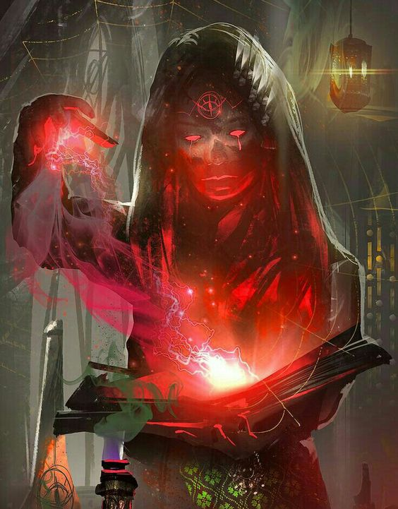

# Magic of Icara

An explanation of the magics of Icara, what it is made up of, and how it is used.

Every caster must be create their own connection with the various magical energies in Icara. The physical indications of magic that make up runic spellbooks and the symbols in circles of power are only a small piece of the puzzle. Magic on Icara takes many forms, from that energies present in every creature on Icara to the strange magical forces that emanate from beyond the planar walls. Strong elemental forces that courses like lifeblood along ley lines through the very core of Icara, and bleed from the connected Fae domains, or is granted from the great beyond by powerful creatures who wear the mantle of god. All of these grant power - but muddy each other, and ebb and surge in unpredictable ways.

# Sources of Magic

## Natural Sources of Magic

Magic is created many different ways, and is readily available for those that no where to look. Magic sources can generally be divided into those of the natural world and those of the supernatural realms. Natural magic just means those things that naturally occur in Icara.

### Elemental (Primordial Energy)

Icara is a world woven with the energies of the interconnected Elemental Planes, which weave and intersect into a number of Elemental Dominions. These energies are the fundamental building blocks of the world, the elements of Air, Water, Fire, Earth, Light, and Shadow. These elements combine to create the essence of most natural things, and flows from the Elemental and Fae dominions throughout Icara, either erupting in a localized place known as an elemental font or along loose pathways of unseen power called ley lines that flow like a powerful current. Elemental Magic is considered the most fundamental of magics.

### Essence (Spirit Energy)

As elemental magic combines to form places, people and things, these things develop their own identity, or essence. The essence of something is greater than the sum of its parts, and has its own power. A tree and a rock each have their own essence, steeped in the identity of what they are, but even they can become part of a larger essence. An undisturbed forest glade, or a long standing stone that has weathered a raging river begins to create a more singular identity as time passes, and the energy and power cultivated by a things being is known as its spirit. The more identity and energy cultivated, the stronger the spirit (or essence) of a place or thing. The Sun has a particular essence, as do the three moons. Water has an essence, but so does the ocean compared to a river. 

Living creatures develop an even stronger spirit, being able to shape their identity The internal, spiritual energy of a creature or thing. Essence can also be refereed to as the natural state of a thing. Essence in animals can be observed in their instincts and natural state. Essence in living and thinking creatures is stronger, and is called many things - inner strength or resolve, chi, or simply a soul.

### Aurae (Passion Energy)

Thinking creatures are blessed with the strong emotions of joy, desire, love, empathy, ecstasy, pride and elation. They are equally cursed with rage, loathing, hate, callousness, despair, shame and grief. The ability to capture and shape the fleeting power born of creature's passions is the hallmark of the fae, a power they call Aurae that they use to drive their most potent enchantments.

### Vitae (Life Energy)

All mortal things (anything that can be killed) contains within it the power of its own life force. Sometimes known as the spark of life, or flame of life, this potent force is often thought of as the most physical expression of a creature's essence (or at least a way to physically manifest a creature's essence.) This is especially true of creatures with inborn magical abilities, such as dragons, blink or displacer animals, or other creatures that manifest magical powers within the natural world. Almost every creature who casts magic taps into their Vitae to help funnel or channel their spells, even if they don't realize what fuels their exhaustion.

## Supernatural Magic Sources

### Celestial (Divine Energy)

When the outer realms were breached, the world of Icara was brought into contact with the realms of the Ascended Eternal, and introduced to the eternal power of the celestial. Unlike the natural magics of Icara, this power seemed immutable, unchangeable, and inexhaustible. The divine does not mingle with the existing powers to create something new, something greater than a sum of its parts, it simply recreated those energies in its own image, a transfiguration from the natural to the divine. Mortals quickly found a calling within it to purify and sanctify their own world, either to "correct" the fallacies of the natural world or to protect it from the profane.

### Infernal (Chaos Energy)

The outer realms also contained the Hells of the Fallen Eternal and the Endless Abyss. This destructive and chaotic power seeks to unmake the divine, but is equally destructive to essence and elemental energies. Those sitting under the thumb of the elemental lords and mighty creatures of Icara found chaos a strong lure, for might of chaos cannot be denied. It is anathema to other magics and energies...a perfect medium for mortals
seeking power over the natural world.

### Fel (Corrupted Energy)

The Arcane magics of Icara have developed a corrupted energy all their own - the Fel, which is vitae, essence or spiritual energy that has been shaped to overwhelm and subvert the essence of other things. In its purest form, neither angel, demon, devil or fae is immune to its touch. Fel energy has slowly seeped across Icara, creating profane abominations of nature, neither dead nor alive. These Fel creatures are commonly known as undead.

### Astral (Energy from the Void)

The Astral plane exists everywhere and nowhere at once, and is the name for the barrier that holds the realms from crossing over into each other. It is a place where logic fails and reality ceases, but manipulating it allows for travel between planes, the creation of pocket dimensions, and the reconsideration of time and distance and seizing of unknowable truths. Wise wizards, however, warn of tinkering too much with the mysterious Astral energy, lest your body or mind become lost in the unknowable emptiness of the Astral Void.

# The Color of Magic

The layperson doesn't care about the specific distinctions of magic. They care about what these arrogant mortals are dabbling in, and whether their neighbor is doing something dangerous or malicious. This is equally important for rulers and judges throughout Icara, who are called upon to judge the wizards, witches, tricksters and priests that operate in their lands. They divide magic by a more simplistic metric - hence the color of magic.

- **White Magic:** Magic considered to be, at worst, benign, and usually helpful or appreciated in the  community.
- **Red Magic:** Dangerous magic, but magic that is useful or necessary during times or war or by government decree. Red magic is generally unlawful to use in towns or peaceful lands, but lawful to use to defend yourself or by nations at war. Some cities allow lawful use by individuals that have been given certain rights or earned certain titles.
- **Black Magic:** Magic considered evil, and only dabbled into by morally bankrupt or evil people and creatures.

While individual nations or towns may have their own rules, the major laws were outlined in the **Pax Perpetua**, as a means of preventing another Age of Apocalypse by spelling out acceptable magics for wizards to learn. Wizard towers gather to both learn spells together and set philosophy about what magic is good and what magic is evil, a thing considered highly debateable to magic users. Some mages, (particularly those who follow the Dark God Magus) argue that no magic is evil, that only uses can be evil, and magic must be learned to be understood. Other witches argue that black magic used for good becomes **Gray Magic** - that the use of black and red magic is tempered by the intention of good.

Many disagree, and certain organizations have taken it upon themselves to protect the land from the evils of unchecked magic.

*"We gather in secret, sisters, as we have done for centuries. We gather that we may placate the Dark Ones, that they do not rise from their places in the shadows and graves and hunt our husbands, our wives, our daughters, our sons. We do this to protect our people, from the brazen kings who condemn us as witches and traitors to the fearful peasants who would behead and quarter us, consigning our flesh to separate bonfires. For we do what we must...we give the dark ones their due, and ensure they are held behind the iron bonds of our pact. We bear this burden in secret, and with no reward, by our sacred oaths and secret spells, that Uruthia not fall into madness."*