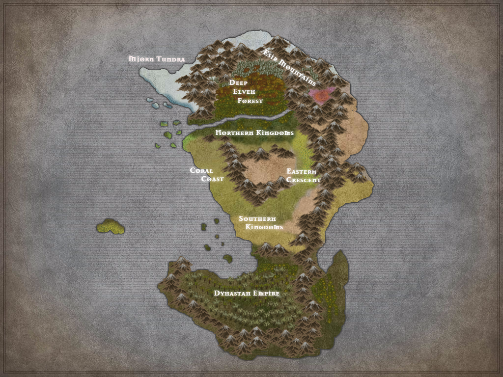

# The world of Icara

Icara is a massive world that sits at a confluence between multiple planes of existence. 

    

Visit the following sections for more information:

- Cultures - A breakdown of the peoples and civilizations that have populated Icara. 
    - Peoples of Icara
    - Calendars
    - History of Icara
    - Civilizations of Icara
- Pantheons - The gods and religions of Icara

